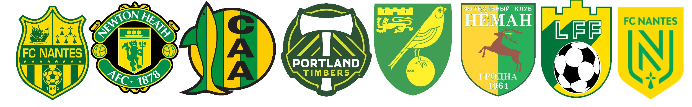

# Still in progress... !!

# Project_Football_Kits_Classifier
Yellow &amp; green colored football  kits classifier.

## Clubs
Model will predict from ten clubs which in different period of time have yellow &amp; green colored football  kits:
* Norwich City F.C.;
* West Bromwich Albion F.C.;
* FC Nantes;
* Club Atletico Aldosivi;
* Manchester United F.C.;
* ADO Den Haag;
* FC Neman Grodno;
* Portland Timbers;
* Sunderland A.F.C.
* Fortuna Sittard

## License
[MIT](https://choosealicense.com/licenses/mit/)

## Render `football_kits_classifier_baseline.ipynb` via nbviewer 
[football_kits_classifier_baseline.ipynb](https://nbviewer.jupyter.org/github/unkind58/Project_Football_Kits_Classifier/blob/main/football_kits_classifier_baseline.ipynb)
